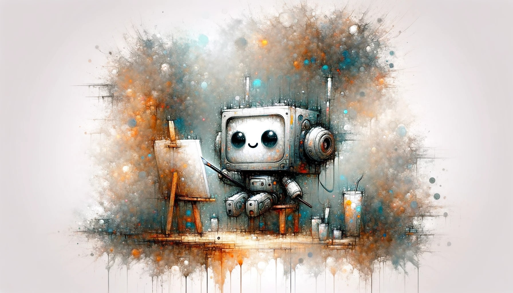

# Artist Bot

This project is a bot that generates and posts images to Instagram based on comments from users. It uses the OpenAI DALL-E API to generate images and the Instagram API to post images.

## Features

- Fetches the latest comments from Instagram posts
- Generates image descriptions based on the comments
- Uses OpenAI DALL-E API to generate images based on the descriptions
- Posts the generated images to Instagram

## Installation

1. Clone the repository
2. Install the dependencies with `npm install`
3. Create a `.env` file in the root directory and fill it with your credentials:
    - INSTAGRAM_USERNAME
    - INSTAGRAM_PASSWORD
    - DALLE_API_KEY
    - LAST_N_COMMENTS Process this amount of comments and upload an image for every one.
    - MONOLOGUE_CONTEXT
    - MONOLOGUE_LENGTH
    - LAST_N_COMMENTS

## Usage

You can run the bot manually with `npm run start`.

You can also schedule the bot to run at specific times using the `scheduleJob` function in `src/jobs/artist_bot.ts`. The current configuration runs the bot twice a day at 8 AM and 8 PM.

## Testing

Tests are located in the `tests` directory. You can run them with `npm run test`.

## Contributing

Pull requests are welcome. For major changes, please open an issue first to discuss what you would like to change.

## License
git init
MIT
